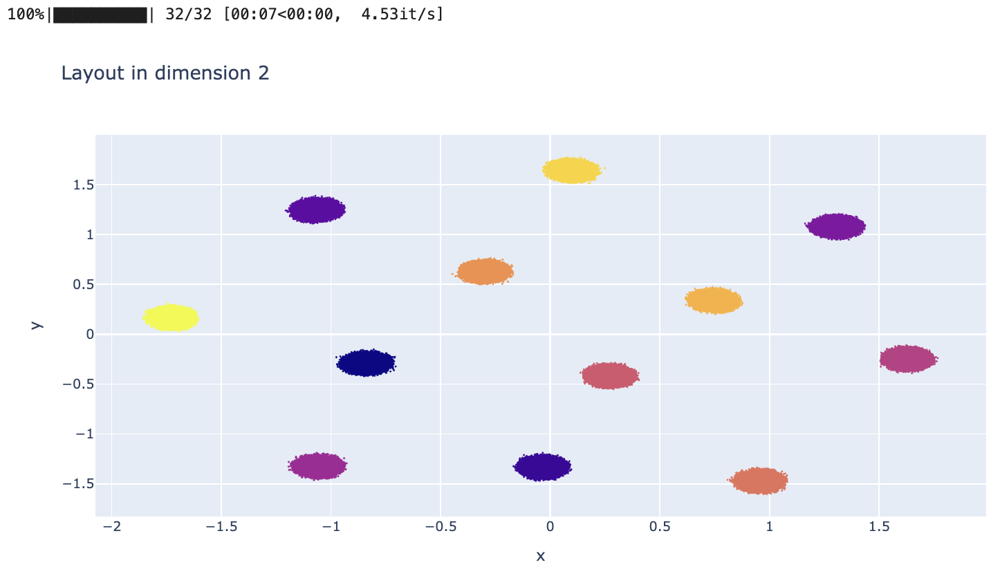

# DiRe - JAX

### A new DImensionality REduction package written in JAX 

We offer a new dimension reduction tool called DiRe - JAX that is benchmarked against the existing approaches: UMAP (original and Rapids.AI versions), and tSNE (Rapids.AI version)

### Quick start

For CPU version, run

    pip install dire-jax[cpu]

For GPU version, run

    pip install dire-jax[gpu]

and then install the latest GPU version of FAISS

    conda install pytorch::faiss-gpu

In Google Colab you will likely need

    !pip install -q condacolab
    import condacolab
    condacolab.install()

before you install anything via Conda. 

Then, do the imports

    from dire_jax import DiRe
    from dire_jax.dire_utils import display_layout

and afterwards, for example, try this: 

```python
from sklearn.datasets import make_blobs

n_samples  = 100_000
n_features = 1_000
n_centers  = 12
features_blobs, labels_blobs = make_blobs(n_samples=n_samples, n_features=n_features, centers=n_centers, random_state=42)

reducer_blobs = DiRe(dimension=2,
                     n_neighbors=16,
                     init_embedding_type='pca',
                     max_iter_layout=32,
                     min_dist=1e-4,
                     spread=1.0,
                     cutoff=4.0,
                     n_sample_dirs=8,
                     sample_size=16,
                     neg_ratio=32,
                     verbose=False,)

layout_blobs = reducer_blobs.fit_transform(features_blobs)
display_layout(layout_blobs, labels_blobs)

```

The output should look similar to




### Working paper

Our working paper is available in the repository. Also, check out the Jupyter notebook with benchmarking results.

### Contributing

Create a fork, contribute, and make a merge request. Thanks!

### Acknowledgement 

This work is supported by the Google Cloud Research Award number GCP19980904.